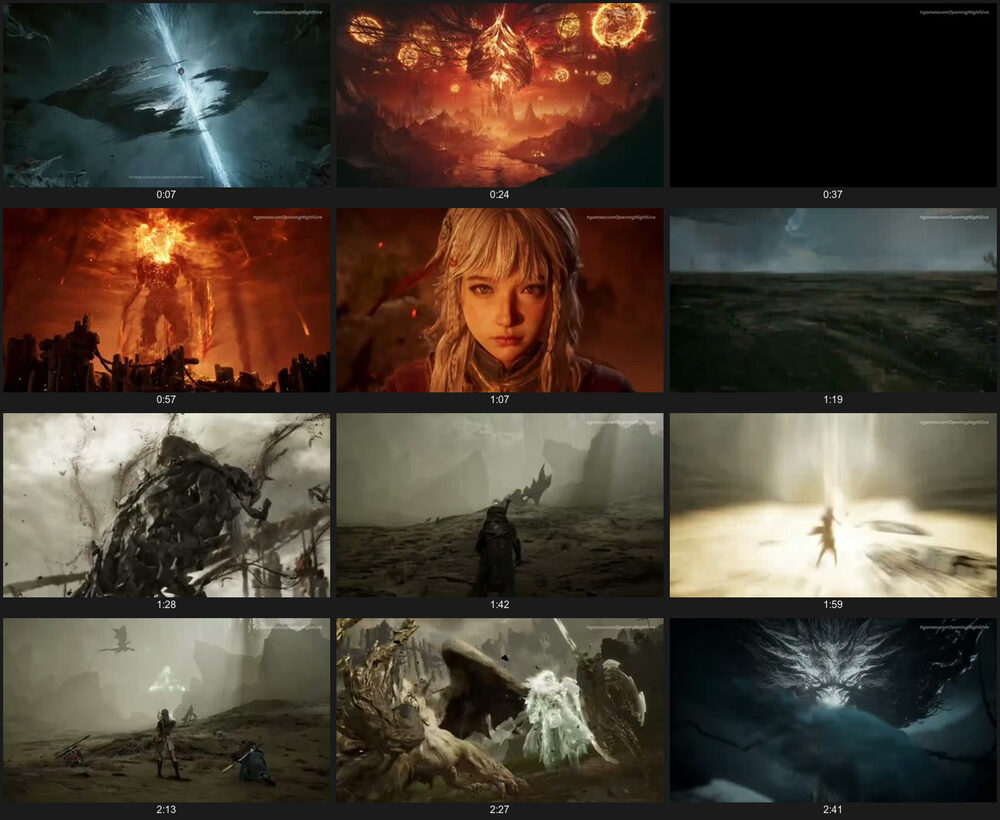
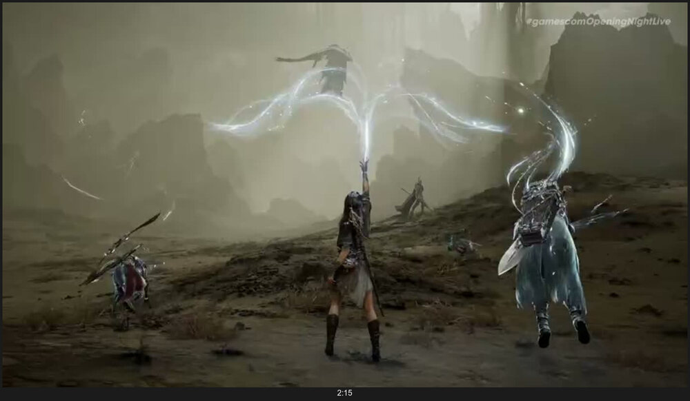

# watchvideo

把一条视频变成模型能读的东西：**字幕**，或者**一张印相样片**。不留视频文件。

*Turn a video into something a model can actually read: **subtitles**, or a single
**contact sheet**. No video file is kept.*

```bash
watchvideo <url>            # 抓字幕，默认纯文本      subtitles, plain text
watchvideo <url> -F         # 拼一张印相样片          one contact sheet
watchvideo <url> --list     # 先看有哪些字幕轨        list available tracks
```

## 长什么样 / What it looks like

一条 2:52 的游戏预告片，12 格排成 3×4，每格 520px——烧录字幕和角色细节都还读得出：

*A 2:52 game trailer as 12 cells in a 3×4 grid, 520px each — burned-in captions and
character detail both survive:*



## 为什么不直接用 yt-dlp / Why not just yt-dlp

小红书（RedNote）的视频带真的 srt 字幕轨（`sns-subtitle-s2.xhscdn.com`，常见
`zh-CN` / `en-US` / `source` 三条），但 yt-dlp 的 `xiaohongshu.py` 里**一行字幕代码都没有**，
只会回一句 `has no subtitles`。那不是"站上没有"，是"工具没做"。这里自己从页面 JSON 解析。

*Xiaohongshu (RedNote) videos do carry real srt subtitle tracks, but yt-dlp's
`xiaohongshu.py` contains **no subtitle code at all** — it just says
`has no subtitles`. That is not evidence the site lacks them; it means the
extractor never implemented them. This tool parses them out of the page JSON.*

两个坑：小红书**必须匿名抓**——带登录 cookie 时它返回的是另一套残缺页面，既没有字幕块
也没有可下载的 video format；解析时只还原 `/`、`&`、`\"` 三种转义，别整篇
`unicode_escape`，那会毁掉中文。

*Two traps: you **must fetch anonymously** — with login cookies the site returns a
different, stripped-down page carrying neither subtitles nor any downloadable video
format. And unescape only `/`, `&` and `\"`; a blanket `unicode_escape` will destroy CJK text.*

## 为什么样片要拼成一张 / Why one sheet instead of N images

因为逐张递图给模型，模型会**跳着看**。

*Because when you hand a model N separate images, it **skips some of them**.*

这个工具的起因是一次失败：23 帧逐张读进去，模型自己挑着看、跳过了其中 5 张，而唯一能
认出画面里那个人是谁的关键帧，正在被跳过的那几张里。抽帧质量没问题，问题在呈现——
N 张孤立的图片没有时序关系，注意力还会随张数衰减。

*This tool started from a failure: 23 frames were read in one by one, the model picked
which ones to look at, skipped 5 of them — and the only frame that identified the person
on screen was among the skipped ones. The extraction was fine; the presentation was not.
N isolated images carry no temporal relationship, and attention decays across them.*

拼成一张网格、每格标时间戳，模型没法跳帧，还能一眼看到时间线。需要细节时再按时间戳
单独放大那一格。

*Tiled into one grid with a timestamp under each cell, nothing can be skipped and the
timeline is visible at a glance. Zoom into a single cell by timestamp when you need detail.*

## 先总览，再放大 / Survey first, then zoom

样片是用来**定位**的，不是用来看细节的。挑出可疑的格子之后，用 `-z` 按时间戳把
那一瞬间抽成大图（单帧给到 1400px）。

*The sheet is for **locating**, not for detail. Once a cell looks interesting, `-z`
pulls that exact moment out at full size (1400px for a single frame).*

```bash
watchvideo <url> -F          # 哪一格可疑？        which cell looks interesting?
watchvideo <url> -z 2:15     # 把它抽出来看清楚     pull it out and look properly
```

这个工作流是有实际代价的教训。上面那张样片里 2:13 那格，看着像"持剑者与跪着的人
对峙"。放大之后：

*This workflow came from getting it wrong. In the sheet above, the cell at 2:13 looked
like "a swordsman facing someone kneeling". Zoomed in:*



五个角色各打各的位——那不是对峙，是多人同屏。缩略图能告诉你哪里值得看，
但不足以让你断定看到了什么。

*Five characters spread across the field — not a standoff, a co-op party. Thumbnails
tell you where to look; they are not enough to conclude what you saw.*

## 关于格数 / On the number of cells

格数按时长打底（≤15s→6，≤45s→8，≤3min→12，更长→16），**再按实际镜头数取大**，
上限 40 格；`-F N` 可以显式指定。

*Cell count starts from duration (≤15s→6, ≤45s→8, ≤3min→12, longer→16), then takes
**whichever is larger: that, or the number of detected shots**, capped at 40.*

只看时长会漏掉一大半。一条 172 秒的预告片有 35 个镜头，按时长只给 12 格——出品方
logo 那一格就没抽到（黑场抽到了，logo 亮起的下一格没有），骑乘、沼泽、深海全不见。
反过来 20 秒的单镜头视频给 12 格纯属浪费。两者取大才对。

*Duration alone misses most of it: a 172-second trailer holds 35 shots, and 12 cells
skipped the publisher's logo entirely — along with whole biomes. Meanwhile a 20-second
single-shot clip does not need 12.*

格数多到一张放不下时会**自动分成多张**（`.sheet-1.jpg`、`.sheet-2.jpg`），每格保证
不小于 350px。一张 40 格的样片缩放后每格只剩 229px，那个尺寸能看出"有什么"、
看不出"是什么"；分成两张之后每格 390~464px，翻了一倍。按像素卡而不是按格数，
是因为同样 20 格横屏有 390px、竖屏只剩 220px。

*When the cells no longer fit on one image it **splits into several**
(`.sheet-1.jpg`, `.sheet-2.jpg`), keeping every cell at 350px or more. A single 40-cell
sheet shrinks to 229px per cell — enough to see that something is there, not enough to
tell what it is. Split in two, each cell is 390–464px. The threshold is in pixels rather
than cell count because the same 20 cells give 390px landscape but only 220px portrait.*

**别指望用帧间差异去重来解决冗余。** 拿真实样本量过：一条水面拍摄的海獭视频（20 秒
单镜头，冗余最重）和一条室内固定机位的水獭视频，归一化 RMSE 中位数分别是 0.176 和
0.094——冗余最重的那条反而全程更高，因为波光让每帧像素差都很大。换感知哈希 PHASH，
两条几乎重合（2.01 vs 2.30）。像素和感知距离只能回答"画面变了没有"，回答不了
"意思重复了没有"。所以去重只用来清掉肉眼全等的帧，真正控制冗余的是格数。

实测这个分工很清楚：快切的预告片候选 70 帧、去重后剩 56（清掉两成，都是同一镜头
被抽到两次）；而单镜头的水獭视频候选 12 帧、**一帧都去不掉**——它确实一直在动，
只是动作语义重复。去重管"抽重了"，格数管"这片子本来就没那么多信息"。

*The division of labour is measurable: on a fast-cut trailer 70 candidates dedupe down to
56 (a fifth removed, all of them the same shot sampled twice); on a single-shot otter clip
12 candidates dedupe to **12 — nothing removed at all**. The otter really is moving the
whole time; only the meaning repeats. Dedup handles double-sampling, cell count handles
clips that simply hold less.*

***Do not expect frame-difference dedup to solve redundancy.*** *Measured on real samples:
a sea otter filmed on water (20s, single shot, the most redundant clip) versus an otter
indoors on a fixed camera — median normalised RMSE 0.176 vs 0.094. The **most** redundant
clip scores **higher** throughout, because rippling water keeps every pixel delta large.
Perceptual hashing barely separates them either (median PHASH 2.01 vs 2.30). Pixel and
perceptual distance answer "did the picture change", not "did the meaning repeat".
So dedup only removes visually identical frames; cell count is what actually controls redundancy.*

## 安装 / Install

```bash
brew install yt-dlp ffmpeg imagemagick     # macOS
```

Linux 用各自的包管理器装这三个即可。把 `watchvideo.py` 放进 PATH（或做个软链）。

*On Linux install the same three via your package manager. Put `watchvideo.py` on your PATH.*

## 用法 / Usage

```bash
watchvideo <url>                   # 字幕，纯文本（默认）  subtitles, plain text
watchvideo <url> -f srt            # 要时间轴              keep timestamps
watchvideo <url> -l zh-CN          # 指定语种              pick a language
watchvideo <url> -F                # 印相样片              contact sheet
watchvideo <url> -F 20             # 显式给格数            explicit cell count
watchvideo <url> -z 2:15           # 放大某个时间点        zoom into one moment
watchvideo <url> -z 2:11,2:13,2:15 # 放大多个时间点        several moments
watchvideo <url> -o DIR            # 输出目录              output directory
watchvideo <url> --browser chrome  # 借浏览器 cookie       borrow browser cookies
```

环境变量 `WATCHVIDEO_OUT` / `WATCHVIDEO_BROWSER` 可以省掉每次输入。

*`WATCHVIDEO_OUT` / `WATCHVIDEO_BROWSER` set your defaults.*

## 站点 / Sites

样片对 yt-dlp 支持的站点通用；字幕除小红书外也走 yt-dlp。实测过 B 站、小红书、YouTube、X。

*Contact sheets work for anything yt-dlp can download; subtitles go through yt-dlp except
for Xiaohongshu. Tested on Bilibili, Xiaohongshu, YouTube and X.*

- **B 站**的 AI 字幕**必须登录**，要加 `--browser`。刚在浏览器登录完得等几秒再跑：
  Chromium 系 cookie 落盘有延迟，在那之前抽到的是旧登录态，B 站会回一句很误导人的
  `Subtitles are only available when logged in`——那句话跟你登没登其实没关系。

  ***Bilibili*** *AI subtitles require login (`--browser`). Wait a few seconds after logging
  in: Chromium writes cookies to disk lazily, and until it does you get the stale session
  plus a badly misleading `Subtitles are only available when logged in`.*

- **YouTube** 的自动字幕里，真 ASR 那条标成 `<lang>-orig`，其余一两百条都是机翻。
  不指定语种时默认只取原生轨，不然会一次落下一百多个文件。

  ***YouTube*** *marks the real ASR track `<lang>-orig`; the other ~150 are machine
  translations. Without `-l`, only the original is taken.*

## 已知限制 / Known limitations

- 小红书那条路靠解析页面里的 `__INITIAL_STATE__`，**页面结构一变就会失效**。这也是为什么
  小红书的字幕支持更应该进 yt-dlp 上游，而不是长期由这里维护。

  *The Xiaohongshu path parses `__INITIAL_STATE__` and **will break when the page changes**.
  This is exactly why that support belongs upstream in yt-dlp rather than here.*

- 样片标签用 ImageMagick 的 `montage -label`，需要系统里有可用字体；找不到就交回给
  ImageMagick 自己的 fontconfig，某些机器上标签可能不渲染。

  *Labels rely on a usable system font; without one, rendering falls back to fontconfig
  and may come out blank.*

- ASR 会听错专名。有次《牛来》被听成「牛奶」，而画面里的硬字幕写得清清楚楚——要紧的
  视频，字幕和样片两条都跑。

  *ASR mishears proper nouns. One clip's title was transcribed as "milk" while the burned-in
  caption on screen spelled it out correctly. For anything that matters, run both paths.*

## License

MIT
